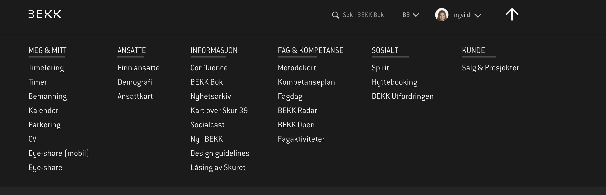

# Semantikk

> **MDN**: [Liste over alle tilgjengelige HTML-elementer](https://developer.mozilla.org/en/docs/Web/HTML/Element)

Semantikk betyr at typen til en HTML-tagg sier noe om hva slags innhold den har.

#### Definisjon
> **Semantikk** er den grenen av lingvistikken (språkvitenskapen) som studerer ordenes betydning, både enkeltvis og i sammenstilte strukturer (setninger).
*Kilde: [Wikipedia](https://no.wikipedia.org/wiki/Semantikk)*

Før brukte vi ofte bare div og span til å bygge en side. Med HTML5 fikk vi mange flere tagger slik at vi kan lage mer beskrivende HTML-strukturer. Dette er både nyttig for utviklerens del - du får bedre oversikt over HTML-dokumentet uten å måtte lese gjennom alt innholdet - og for brukerens del. Brukere som avhenger av skjermleser eller andre spesialverktøy har stor verdi av semantiske strukturer, fordi skjermleseren kan forstå hensikten med elementene. Om den oppdager en `nav`-tagg i nettsiden kan den vite at den inneholder navigasjonselementer - noe som ikke nødvendigvis er like åpenbart med en `<div id="navigation"></div>`. I tillegg er en semantisk struktur lettere å tolke for søkemotorer, og dermed bedre for søkemotoroptimalisering av nettsiden.

```html
<div id="header">..</div>       <header>..</header>
<div class="section">..</div>   <section>..</section>
<div id="navigation">..</div>   <nav>..</nav>
<div class="article">..</div>   <article>..</article>
<div id="sidebar">..</div>      <aside>..</aside>
```

#### Husk
> Hovedregelen er at alle tagger trenger å åpnes og lukkes, eksempel: `<main></main>`. Enkelte elementer **kan ikke** ha innhold og avsluttes direkte: `<br />`

Ikke-semantiske tagger kan fortsatt være nyttige for styling, men man bør ha et bevisst forhold til bruken av dem.

Eksempler på semantiske tagger:
```html
<header></header>
<nav></nav>
<main></main>
<article></article>
<section></section>
<h1></h1>
<p></p>
<a></a>
<button></button>
<aside></aside>
<footer></footer>
```

Eksempler på ikke-semantiske tagger:
```html
<div></div>
<span></span>
```

## WAI-ARIA
I tillegg til semantisk HTML, kan du bruke [WAI-ARIA](https://en.wikipedia.org/wiki/WAI-ARIA) i HTML-elementene dine for å gjøre nettsiden din enda mer tilgjengelig for skjermleser-brukere. Denne [videoen](https://egghead.io/lessons/html-5-intro-to-aria) gir en fin intro til WAI-ARIA og hvordan man bør bruke det sammen med semantisk HTML.

## Oppgaver
* Last ned [denne chrome-extensionen](https://chrome.google.com/webstore/detail/web-developer/bfbameneiokkgbdmiekhjnmfkcnldhhm?hl=no). Med den installert, gå til [vg.no](vg.no), åpne extensionen og velg *Information* &rarr; *View document outline*. Se på hvordan siden er strukturert - har du forslag til forbedringer? Hvordan er konkurrenten [dagbladet.no](dagbladet.no) til sammenlikning?
* Med samme chrome-extension, skru av CSSen (_CSS_ &rarr; _Disable all styles_). Hvordan ser sidene ut?
* Diskuter med sidemannen hvilke HTML-elementer dere ville ha brukt for å representere følgende navigasjonsmeny:

