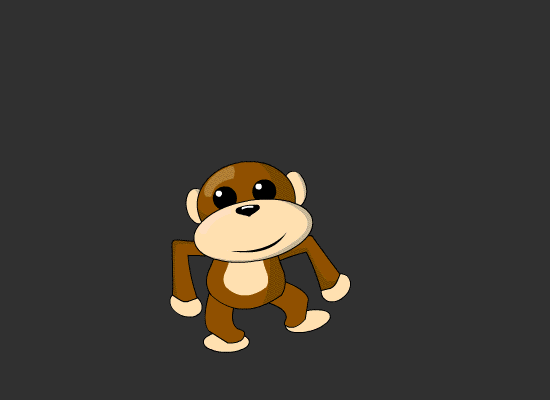

# DOM-apiet

> **MDN**:
* [Oversikt over DOM- og HTML-interfaces](https://developer.mozilla.org/en-US/docs/Web/API/Document_Object_Model)

Javascript gir oss et rikt API mot [DOMen](01-intro-til-weben/03-dom.md) via document-objektet.
Hvis HTML-en inneholder dette...
```html

```
... så kan vi aksessere den slik:

```js
const img = document.querySelector('#mainpicture');
```

```html
<div id="boks">
    <a href="mer.html">Klikk her</a> for å lære mer
</div>
```

```javascript
const boks = document.querySelector('#boks');

boks.innerHTML; // <a href="mer.html">Klikk her</a> for å lære mer
boks.textContent; // Klikk her for å lære mer
```

## Hendelser
Med DOM-apiet kan vi også legge til hendelser når noe skjer med et dom-element.
Vi gjør dette ved å legge på lyttere som venter på at en gitt hendelse skal skje, f.eks. et klikk på en knapp:

```js
document.querySelector('#boks').addEventListener('click', function() {
    // Gjør noe gøy når boks har blitt trykket på!
});
```

Vi kan også erstatte innhold med noe annet:
```javascript
document.querySelector('#danse-ape').addEventListener('click', function() {
    var el = document.querySelector('#danse-ape');
    var src = el.getAttribute('src').replace('.png', '.gif');
    el.setAttribute('src', src);
});
```

<div class="col" style="overflow: hidden;">
  
</div>


## Oppgaver
* [Test ut DOM-apiet](http://jsbin.com/povoyoz/24/edit?js,console)

* Fortsett med knappene du lagde i [kapittel 2](../02-html/06-knapper).
  * Legg til unike `id`-attributter på `output` og `button`-elementene.
  * Legg til en click event handler som legger til 1 på tallet i `output` når man trykker på plussknappen.
  * Legg til en click event handler som trekker fra 1 fra tallet i `output` når man trykker på minusknappen.
