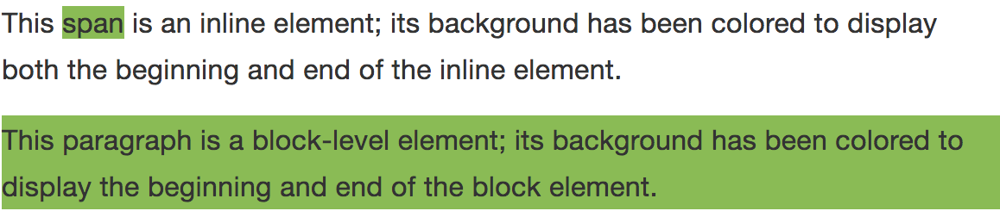

# Elementer


**Dokumentasjon fra MDN**:

* [Liste over alle tilgjengelige HTML-elementer](https://developer.mozilla.org/en/docs/Web/HTML/Element)
* [Block level elements](https://developer.mozilla.org/en-US/docs/Web/HTML/Block-level_elements)
* [Inline elements](https://developer.mozilla.org/en-US/docs/Web/HTML/Inline_elements)


HTML-dokumenter inneholder en rekke elementer som enten er self closing, altså lukker seg selv; eller som har underelementer, ofte referert til som `children`. Disse elementene ser ut som følger:

```markup
<tag />

<tag>Innhold (child)</tag>

<tag>
  <tag>
    Man kan ha mange underelementer (children) under en tag.
  </tag>
  <tag>
    Så mange man vil, faktisk.
  </tag>
</tag>
```

I denne settingen er ikke `tag` et faktisk HTML-element vi pleier å bruke, men en placeholder for alle de mulige HTML-elementene som finnes. Se lenken øverst for en oversikt.

## Attributter

Et HTML-element kan ha flere attributter som bestemmer hvordan den skal oppføre seg eller se ut:

```markup
<tag
    attribute1="value1"
    attribute2="value2"
>
    Innhold
</tag>
```

Hvilke attributter som er tilgjengelig på de ulike elementene, kan man finne i dokumentasjonen til HTML-elementene. Igjen anbefaler vi å bruke [MDN](https://developer.mozilla.org/en-US/) som oppslagsverk, siden dokumentasjonen deres er grundig og oppdatert.

## Block og inline

Vi har nå ulike HTML-elementer med egenskaper som bestemmes av hvilken tag eller type de har. En av disse egenskapene er hvordan elementet oppfører seg i nettleseren, og vi sier gjerne at HTML-elementer enten er _block-level_ eller _inline_.

Block-level innebærer at elementer begynner på en ny linje, mens inline-elementer kan starte hvor som helst på en linje. Mange browsere har ny linje både før _og_ etter block-level-elementer, så man kan forestille seg disse elementene som et tårn med bokser som ligger oppå hverandre.

```markup
<p>This <span>span</span> is an inline element; its background has been 
colored to display both the beginning and end of the inline element.</p>

<p>This paragraph is a block-level element; its background has been colored 
to display the beginning and end of the block element.</p>
```




