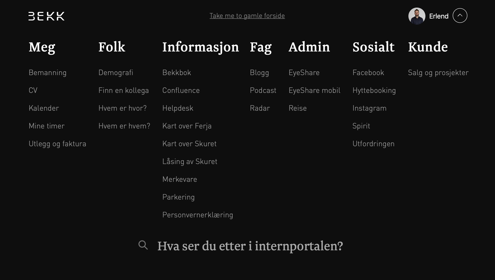

# Semantikk


**MDN:** [Liste over alle tilgjengelige HTML-elementer](https://developer.mozilla.org/en/docs/Web/HTML/Element)


## Definisjon

> **Semantikk** er den grenen av lingvistikken \(språkvitenskapen\) som studerer ordenes betydning, både enkeltvis og i sammenstilte strukturer \(setninger\). _Kilde:_ [_Wikipedia_](https://no.wikipedia.org/wiki/Semantikk)

Før brukte vi ofte bare div og span til å bygge en side. Med HTML5 fikk vi mange flere tagger slik at vi kan lage mer beskrivende HTML-strukturer. Dette er både nyttig for utviklere og brukere av nettsiden. Utviklere får bedre oversikt over HTML-dokumentet og hva den semantiske betydningen av de ulike delene er. Samtidig har brukere som avhenger av skjermleser eller andre spesialverktøy stor verdi av semantiske strukturer, fordi skjermleseren kan forstå hensikten med elementene. Om den oppdager en `nav`-tag i nettsiden kan den vite at den inneholder navigasjonselementer, noe som ikke nødvendigvis er like åpenbart med en `<div id="navigation"></div>`. I tillegg er en semantisk struktur lettere å tolke for søkemotorer, og dermed bedre for søkemotoroptimalisering av nettsiden.

```markup
<div id="header">..</div>       <header>..</header>
<div class="section">..</div>   <section>..</section>
<div id="navigation">..</div>   <nav>..</nav>
<div class="article">..</div>   <article>..</article>
<div id="sidebar">..</div>      <aside>..</aside>
```

## Husk

> Hovedregelen er at alle tagger trenger å åpnes og lukkes, eksempel: `<main></main>`. Enkelte elementer **kan ikke** ha innhold og avsluttes direkte: `<br />`

Ikke-semantiske tagger kan fortsatt være nyttige for styling, men man bør ha et bevisst forhold til bruken av dem.

Eksempler på semantiske tagger:

```markup
<header></header>
<nav></nav>
<main></main>
<article></article>
<section></section>
<h1></h1>
<p></p>
<a></a>
<button></button>
<aside></aside>
<footer></footer>
```

Eksempler på ikke-semantiske tagger:

```markup
<div></div>
<span></span>
```

## Oppgaver

* Last ned [denne chrome-extensionen](https://chrome.google.com/webstore/detail/web-developer/bfbameneiokkgbdmiekhjnmfkcnldhhm?hl=no). Med den installert, gå til [vg.no](https://github.com/bekk/web-intro/tree/645b85b7c83346bcb1576cba234407c4d12e6175/02-html/vg.no), åpne extensionen og velg _Information_ → _View document outline_. Se på hvordan siden er strukturert - har du forslag til forbedringer? Hvordan er konkurrenten [dagbladet.no](https://github.com/bekk/web-intro/tree/645b85b7c83346bcb1576cba234407c4d12e6175/02-html/dagbladet.no) til sammenlikning?
* Med samme chrome-extension, skru av CSSen \(_CSS_ → _Disable all styles_\). Hvordan ser sidene ut?
* Diskuter med sidemannen hvilke HTML-elementer dere ville ha brukt for å representere følgende navigasjonsmeny:

  

