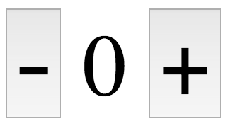

# Knapper


**Dokumentasjon fra MDN:**[`button`-taggen](https://developer.mozilla.org/en-US/docs/Web/HTML/Element/button)  
**Dokumentasjon fra DIFI**: [Krav og anbefalinger for knapper og klikkflater](https://uu.difi.no/krav-og-regelverk/losningsforslag-web/klikkeflate-navigasjon)


Knapper representeres med taggen `button` i HTML.

```markup
<button type="button">Trykk på meg!</button>
```

Knapper får automatisk en default styling av nettleseren, som du kan velge å overstyre med din egen CSS. Hvis du ikke spesifiserer et `type`-attributt på knappen vil nettleseren anta at typen er `submit`, altså at knappen utløser en skjemainnsending for nærmeste `form`-element. Om du vil ha en knapp som ikke har default-oppførsel, men styres av klient-kode \(JavaScript\), kan du sette typen til `type="button"` slik som i eksempelet over.

## Oppgave

Bruk HTML-elementene `<button>` og `<output>` til å lage layouten under på nettsiden din. Du trenger ikke å implementere noe funksjonalitet, det tar vi senere.



