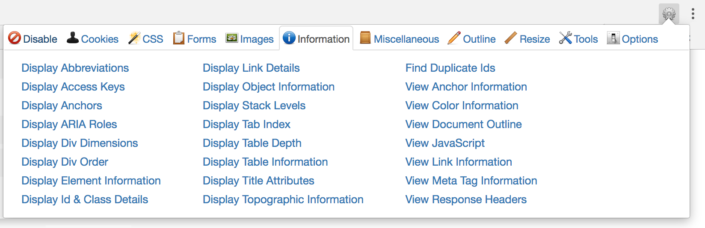

# HTML

Forkortelsen HTML står for HyperText Markup Language, og er det vi bruker til å beskrive strukturen og innholdet til en nettside. HTML er [markup](https://en.wikipedia.org/wiki/Markup_language), og ikke et programmeringsspråk.

HTML sier ingenting om utseende eller oppførsel. De oppgavene er overlatt henholdsvis til CSS og JavaScript. Med [denne chrome-extensionen](https://chrome.google.com/webstore/detail/web-developer/bfbameneiokkgbdmiekhjnmfkcnldhhm?hl=no) kan du skru av cssen på hvilken som helst nettside og se den rå HTML-strukturen som ligger bak. Extensionen ser sånn ut når den er installert i chrome:


Tips!

Ved å skru av CSS får du god oversikt over HTMLen på siden din, og du kan avdekke problemer i semantikk eller struktur. For brukere med skjermlesere er en god struktur og semantikk avgjørende for at de enkelt kan finne det de trenger på siden din. Mer om dette i [seksjonen om universell utforming](../cover-3.md)


