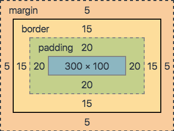

# Box model

> **MDN**: [CSS Box Model](https://developer.mozilla.org/en-US/docs/Web/CSS/CSS_Box_Model)

## Box sizing

Med CSS kan vi sette en del verdier som påvirker både den ytre størrelsen på et element og den indre størrelsen på innholdet i elementet.

For å vise dette har vi laget en liten boks på 300x100px:

```css
.min-boks {
    width: 300px;
    height: 100px;
    padding: 0px;
    border: 0px solid gray;
    margin: 0px;
}
```

Lorem ipsum

Hvis vi nå endrer på propertyen `padding` kan vi se hvordan den indre størrelsen endrer seg:

```css
.min-boks {
    width: 300px;
    height: 100px;
    padding: 20px;
    border: 0px solid gray;
    margin: 0px;
}
```

Lorem ipsum

La oss endre på bredden på `border` for å se hva dette gjør:

```css
.min-boks {
    width: 300px;
    height: 100px;
    padding: 20px;
    border: 15px solid gray;
    margin: 0px;
}
```

Lorem ipsum

Hvis vi legger til en ny boks ved siden av, kan vi se hvordan boksens ytre grenser defineres:

```css
.min-boks {
    width: 300px;
    height: 100px;
    padding: 20px;
    border: 15px solid gray;
    margin: 0px;
}
```

 Lorem ipsum Lorem ipsum

Når vi endrer `margin` lager boksen seg et slags usynlig skjold som holder andre elementer unna:

```css
.min-boks {
    width: 300px;
    height: 100px;
    padding: 20px;
    border: 15px solid gray;
    margin: 5px;
}
```

Lorem ipsumLorem ipsum

## Box model

Alt vi har endret på nå inngår i noe som heter "the Box Model". Modellen beskriver plassen et element tar opp, og hvordan plassen skal brukes. Med andre ord: hvordan elementet skal pakkes inn.

I DevTools under Elements er det en fane som heter "Computed" - den viser oss de beregnede verdiene for stylingen for elementet som inspiseres i DOM-en. Der finner vi også en visuell fremstilling av elementets Box Model som er veldig nyttig under debugging:



